# Mini Project 2 – Object Counting

Nama : Hasna Widyaningrum

NRP : 5024241004

Mata Kuliah : Pengolahan Citra dan Video

---

# Deskripsi

Mini Project 2 bertujuan untuk menghitung jumlah kendaraan pada citra aerial area parkir menggunakan teknik pengolahan citra digital tanpa menggunakan deep learning maupun model pre-trained. Pada proyek ini dilakukan tiga pendekatan berbeda yang mewakili materi yang telah dipelajari, yaitu:

1. HSV Segmentation
2. Edge Detection
3. Otsu Thresholding

Tujuan utama proyek ini adalah mengeksplorasi kemampuan berbagai teknik pengolahan citra dalam melakukan object counting serta membandingkan kelebihan dan kekurangan masing-masing metode.

---

# Dataset

Input citra:


Citra merupakan foto aerial area parkir yang berisi 29 kendaraan dengan berbagai warna, ukuran, dan posisi parkir.

---

# Percobaan 1 – HSV Segmentation (Color-Based)

## Tujuan

Percobaan ini bertujuan mendeteksi kendaraan berdasarkan informasi warna menggunakan ruang warna HSV (Hue, Saturation, Value). Pendekatan ini dipilih karena HSV memisahkan informasi warna dan kecerahan sehingga diharapkan kendaraan dapat dibedakan dari latar belakang area parkir.

## Pipeline

```text
RGB → HSV → Threshold → Morphology → Connected Components → Counting
```

---

## Tahap 1 – Konversi RGB ke HSV

### Hue Channel

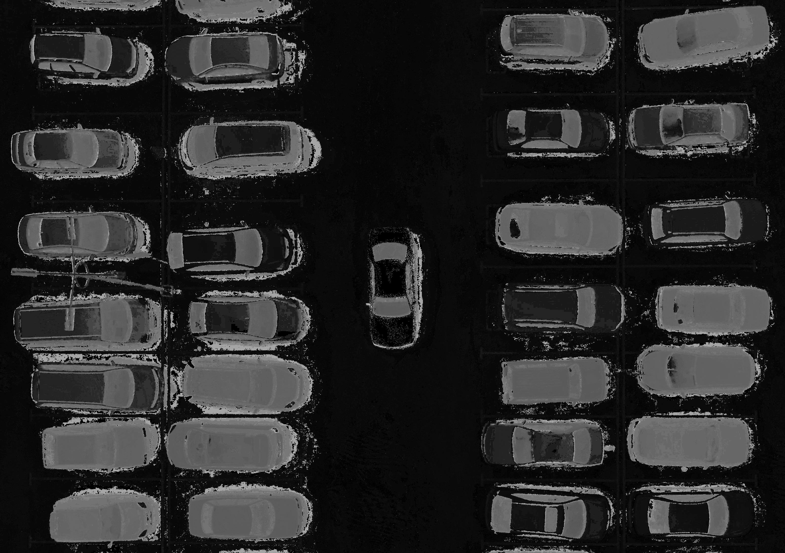

Kanal Hue merepresentasikan jenis warna pada citra. Nilai Hue digunakan untuk membedakan warna objek tanpa dipengaruhi oleh tingkat kecerahan.

### Saturation Channel

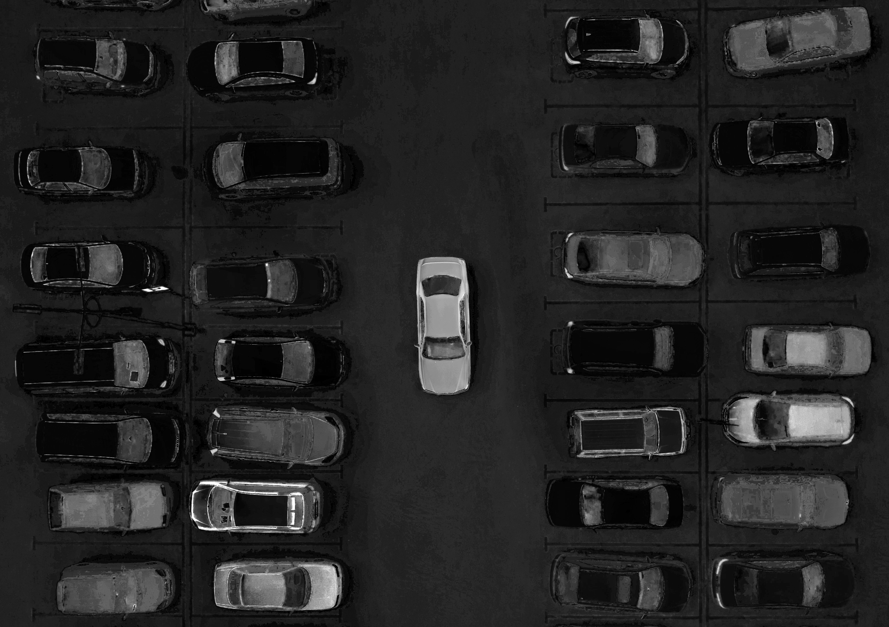

Kanal Saturation menunjukkan tingkat kejenuhan warna. Nilai yang tinggi menunjukkan warna yang lebih kuat, sedangkan nilai rendah menunjukkan warna yang mendekati abu-abu.

### Value Channel

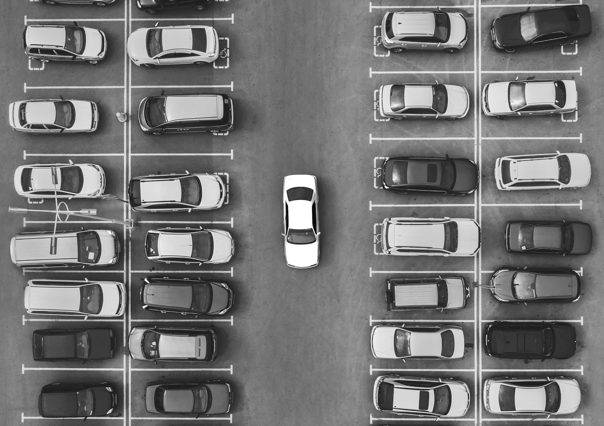

Kanal Value merepresentasikan tingkat kecerahan piksel. Objek yang lebih terang akan memiliki nilai Value yang lebih tinggi dibandingkan area yang lebih gelap.

### Histogram HSV

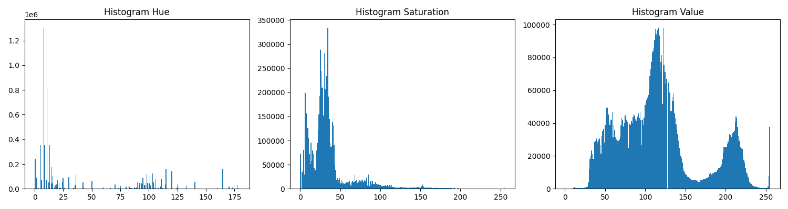

Histogram digunakan untuk melihat distribusi nilai piksel pada masing-masing kanal HSV. Informasi ini membantu memahami karakteristik citra sebelum dilakukan proses segmentasi.

### Analisis Tahap 1

Dari visualisasi HSV terlihat bahwa kanal Value memberikan kontras yang cukup baik antara kendaraan dan aspal. Kanal Hue juga menunjukkan perbedaan warna antar objek, sedangkan Saturation cenderung kurang memberikan pemisahan yang jelas pada citra ini.

---

## Tahap 2 – Thresholding pada Kanal HSV

### Hue Mask

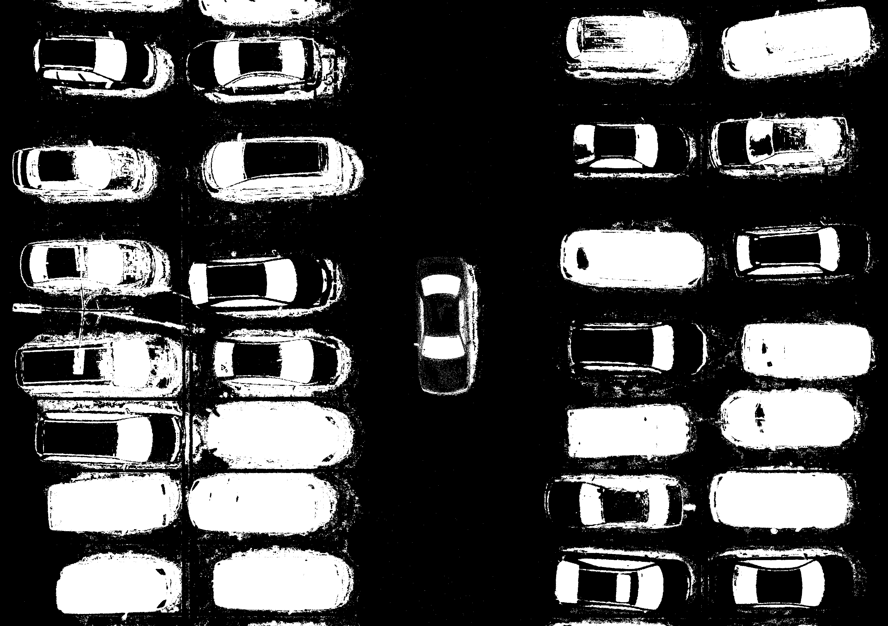

Hasil thresholding pada kanal Hue.

### Saturation Mask

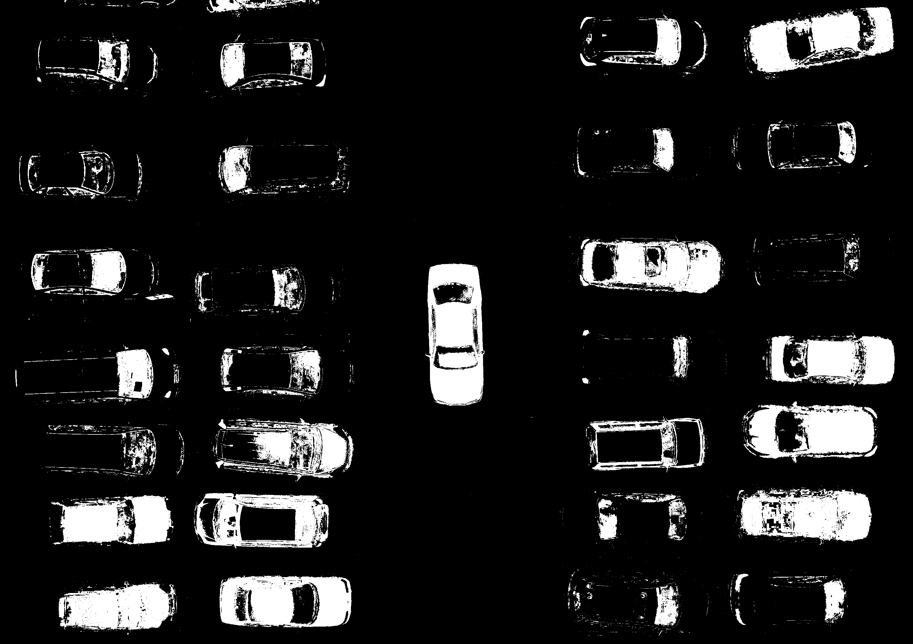

Hasil thresholding pada kanal Saturation.

### Value Mask

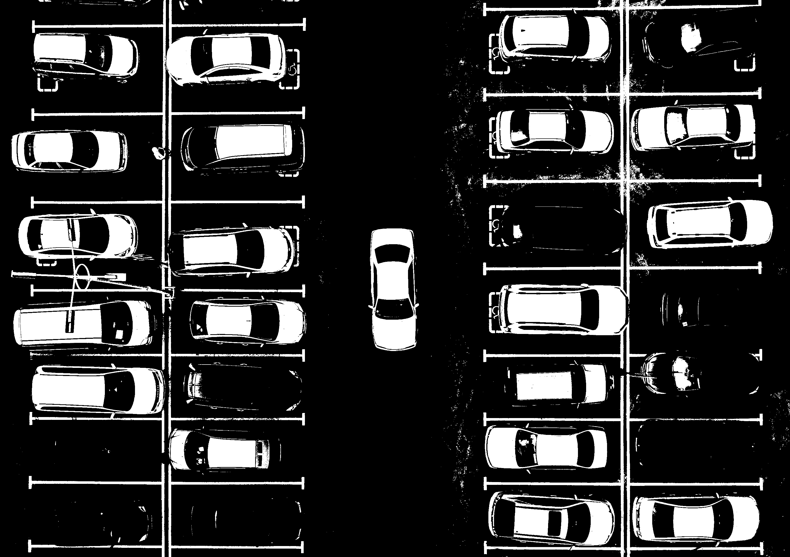

Hasil thresholding pada kanal Value.

### Analisis Tahap 2

Thresholding dilakukan untuk memisahkan piksel yang dianggap sebagai objek dari latar belakang. Dari ketiga kanal, terlihat bahwa setiap kanal memberikan hasil segmentasi yang berbeda. Kanal Value cenderung mempertahankan objek terang, sedangkan Hue dan Saturation memberikan hasil yang lebih bervariasi tergantung warna kendaraan.

---

## Tahap 3 – HSV Segmentation

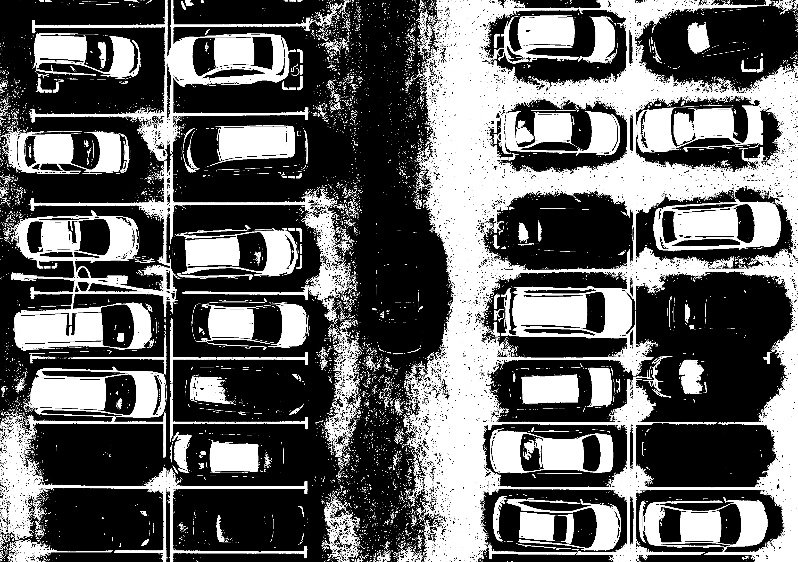

Segmentasi dilakukan menggunakan fungsi `cv2.inRange()` dengan rentang HSV tertentu. Piksel yang memenuhi rentang tersebut akan dianggap sebagai objek, sedangkan piksel lainnya dianggap sebagai latar belakang.

### Analisis Tahap 3

Pada tahap ini sebagian besar kendaraan berwarna terang berhasil dipisahkan dari area aspal. Namun masih terdapat area non-kendaraan yang ikut tersegmentasi dan beberapa kendaraan berwarna gelap yang tidak terdeteksi dengan baik.

---

## Tahap 4 – Morphology

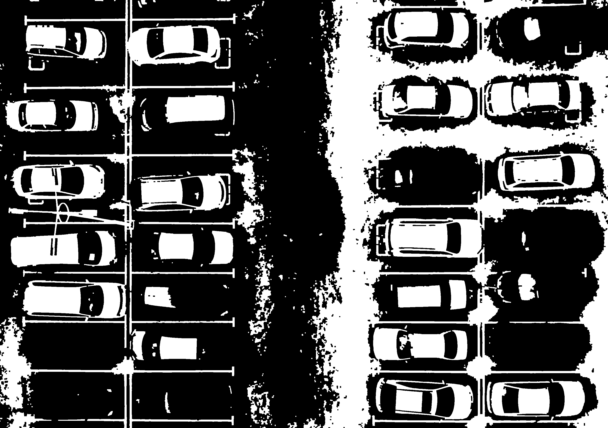

Operasi Morphological Opening digunakan untuk menghilangkan noise kecil, sedangkan Morphological Closing digunakan untuk menyambungkan bagian objek yang terputus.

### Analisis Tahap 4

Morphology membantu membersihkan hasil segmentasi sehingga objek menjadi lebih jelas dan lebih mudah dihitung. Beberapa noise berhasil dihilangkan, namun masih terdapat objek yang saling menempel dan beberapa kendaraan yang hanya tersegmentasi sebagian.

---

## Tahap 5 – Connected Components dan Counting


Connected Components digunakan untuk mencari komponen yang saling terhubung pada hasil segmentasi. Komponen yang memiliki luas sesuai kriteria dianggap sebagai objek kendaraan dan diberikan bounding box.

### Hasil

Jumlah objek terdeteksi:

```text
31
```

### Analisis Tahap 5

Metode HSV menghasilkan jumlah deteksi yang paling mendekati jumlah kendaraan pada citra. Akan tetapi, hasil deteksi belum sepenuhnya akurat. Beberapa kendaraan hanya terdeteksi sebagian sehingga bounding box tidak mencakup seluruh kendaraan. Selain itu terdapat kendaraan yang berdekatan dan tergabung menjadi satu komponen besar. Oleh karena itu jumlah objek yang terdeteksi tidak selalu sama dengan jumlah kendaraan sebenarnya.

---

## Kesimpulan Percobaan 1

HSV Segmentation mampu memanfaatkan informasi warna untuk membedakan kendaraan dari latar belakang. Dibandingkan metode lain yang diuji pada mini project ini, pendekatan HSV menghasilkan jumlah deteksi yang paling mendekati kondisi sebenarnya. Namun metode ini masih sensitif terhadap variasi warna kendaraan dan kondisi pencahayaan sehingga belum mampu mendeteksi seluruh kendaraan secara sempurna.

---

# Percobaan 2 – Edge Detection

## Tujuan

Percobaan ini bertujuan mendeteksi kendaraan berdasarkan informasi tepi (edge) pada citra. Pendekatan ini memanfaatkan perubahan intensitas piksel untuk menemukan batas-batas objek sehingga bentuk kendaraan dapat terlihat lebih jelas.

## Pipeline

```text
RGB → Grayscale → Blur → Canny → Dilation → Contour → Counting
```

---

## Tahap 1 – Konversi ke Grayscale

### Grayscale Image


Citra RGB dikonversi menjadi grayscale untuk menyederhanakan informasi citra sehingga proses deteksi tepi dapat dilakukan dengan lebih efisien.

### Analisis Tahap 1

Pada tahap ini informasi warna dihilangkan dan hanya intensitas cahaya yang dipertahankan. Hal ini mempermudah proses deteksi tepi karena algoritma tidak perlu memproses tiga kanal warna sekaligus.

---

## Tahap 2 – Gaussian Blur

### Gaussian Blur

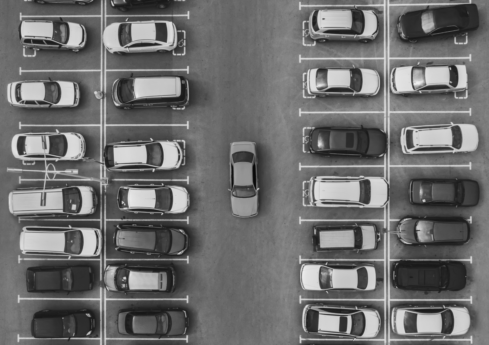

Gaussian Blur digunakan untuk mengurangi noise dan detail kecil yang dapat mengganggu proses deteksi tepi.

### Analisis Tahap 2

Proses blur membuat citra menjadi lebih halus sehingga tepi yang terdeteksi nantinya lebih stabil. Noise kecil yang sebelumnya dapat menghasilkan edge palsu menjadi berkurang.

---

## Tahap 3 – Canny Edge Detection

### Canny Edge

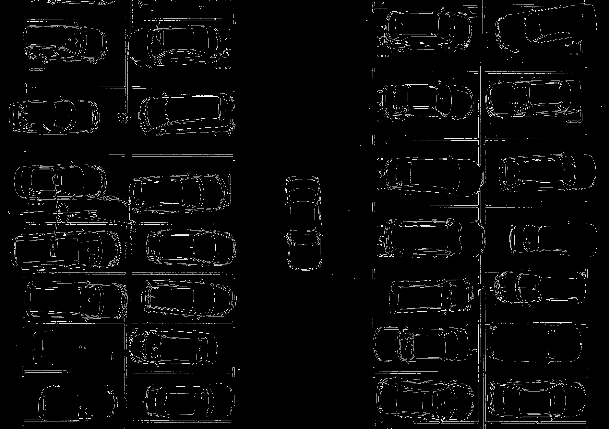

Algoritma Canny digunakan untuk mendeteksi perubahan intensitas yang signifikan sehingga menghasilkan garis-garis tepi objek.

### Analisis Tahap 3

Pada hasil Canny terlihat bahwa bentuk kendaraan mulai muncul dalam bentuk garis tepi. Selain kendaraan, marka parkir dan beberapa detail lain juga ikut terdeteksi karena memiliki kontras yang cukup tinggi terhadap lingkungan sekitarnya.

---

## Tahap 4 – Dilation

### Dilation Result

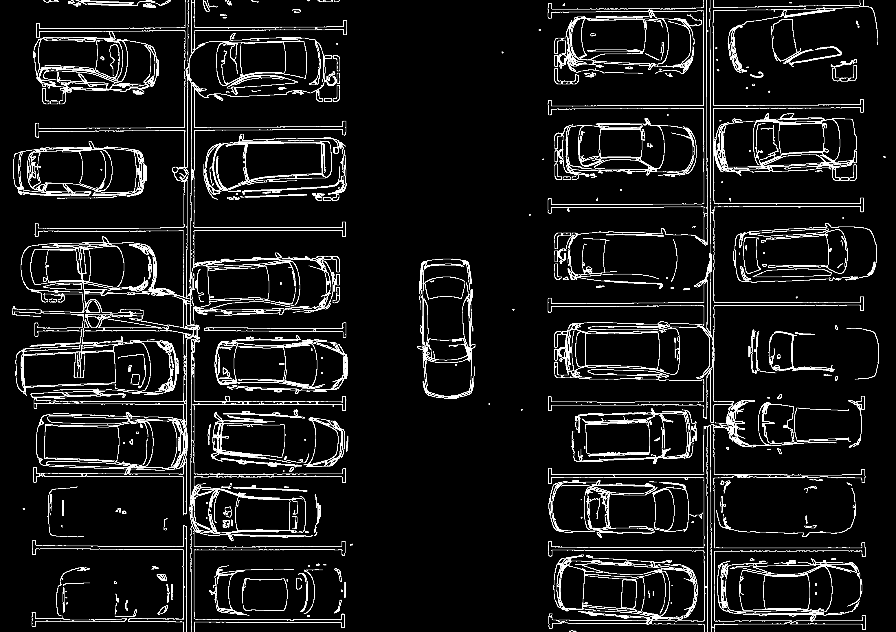

Operasi dilasi digunakan untuk menebalkan garis tepi dan menyambungkan edge yang sebelumnya terputus.

### Analisis Tahap 4

Dilasi membantu membentuk area edge yang lebih utuh sehingga contour lebih mudah ditemukan. Namun masih terdapat banyak kendaraan yang belum membentuk region tertutup secara sempurna.

---

## Tahap 5 – Contour Detection dan Counting

### Bounding Box Result


Contour digunakan untuk menemukan objek berdasarkan area yang terbentuk dari hasil edge detection. Objek yang memenuhi batas luas tertentu dianggap sebagai kendaraan.

### Hasil

Jumlah objek terdeteksi:

```text
13
```

### Analisis Tahap 5

Meskipun bentuk kendaraan terlihat cukup jelas pada hasil Canny, banyak kendaraan tidak menghasilkan region tertutup yang lengkap. Akibatnya contour tidak dapat mengenali seluruh kendaraan sebagai objek yang valid. Selain itu beberapa kendaraan menghasilkan contour yang sangat kecil sehingga terfilter oleh batas area yang digunakan.

---

## Kesimpulan Percobaan 2

Metode Edge Detection mampu menampilkan bentuk kendaraan dengan cukup baik melalui informasi tepi. Namun metode ini kurang efektif untuk proses counting karena kendaraan tidak selalu membentuk region tertutup yang dapat dihitung menggunakan contour. Akibatnya jumlah kendaraan yang terdeteksi jauh lebih sedikit dibandingkan kondisi sebenarnya (undercounting).

---

# Percobaan 2 – Edge Detection

## Tujuan

Percobaan ini bertujuan mendeteksi kendaraan berdasarkan informasi tepi (edge) pada citra. Pendekatan ini memanfaatkan perubahan intensitas piksel untuk menemukan batas-batas objek sehingga bentuk kendaraan dapat terlihat lebih jelas.

## Pipeline

```text
RGB → Grayscale → Blur → Canny → Dilation → Contour → Counting
```

---

## Tahap 1 – Konversi ke Grayscale

### Grayscale Image


Citra RGB dikonversi menjadi grayscale untuk menyederhanakan informasi citra sehingga proses deteksi tepi dapat dilakukan dengan lebih efisien.

### Analisis Tahap 1

Pada tahap ini informasi warna dihilangkan dan hanya intensitas cahaya yang dipertahankan. Hal ini mempermudah proses deteksi tepi karena algoritma tidak perlu memproses tiga kanal warna sekaligus.

---

## Tahap 2 – Gaussian Blur

### Gaussian Blur


Gaussian Blur digunakan untuk mengurangi noise dan detail kecil yang dapat mengganggu proses deteksi tepi.

### Analisis Tahap 2

Proses blur membuat citra menjadi lebih halus sehingga tepi yang terdeteksi nantinya lebih stabil. Noise kecil yang sebelumnya dapat menghasilkan edge palsu menjadi berkurang.

---

## Tahap 3 – Canny Edge Detection

### Canny Edge


Algoritma Canny digunakan untuk mendeteksi perubahan intensitas yang signifikan sehingga menghasilkan garis-garis tepi objek.

### Analisis Tahap 3

Pada hasil Canny terlihat bahwa bentuk kendaraan mulai muncul dalam bentuk garis tepi. Selain kendaraan, marka parkir dan beberapa detail lain juga ikut terdeteksi karena memiliki kontras yang cukup tinggi terhadap lingkungan sekitarnya.

---

## Tahap 4 – Dilation

### Dilation Result


Operasi dilasi digunakan untuk menebalkan garis tepi dan menyambungkan edge yang sebelumnya terputus.

### Analisis Tahap 4

Dilasi membantu membentuk area edge yang lebih utuh sehingga contour lebih mudah ditemukan. Namun masih terdapat banyak kendaraan yang belum membentuk region tertutup secara sempurna.

---

## Tahap 5 – Contour Detection dan Counting

### Bounding Box Result


Contour digunakan untuk menemukan objek berdasarkan area yang terbentuk dari hasil edge detection. Objek yang memenuhi batas luas tertentu dianggap sebagai kendaraan.

### Hasil

Jumlah objek terdeteksi:

```text
13
```

### Analisis Tahap 5

Meskipun bentuk kendaraan terlihat cukup jelas pada hasil Canny, banyak kendaraan tidak menghasilkan region tertutup yang lengkap. Akibatnya contour tidak dapat mengenali seluruh kendaraan sebagai objek yang valid. Selain itu beberapa kendaraan menghasilkan contour yang sangat kecil sehingga terfilter oleh batas area yang digunakan.

---

## Kesimpulan Percobaan 2

Metode Edge Detection mampu menampilkan bentuk kendaraan dengan cukup baik melalui informasi tepi. Namun metode ini kurang efektif untuk proses counting karena kendaraan tidak selalu membentuk region tertutup yang dapat dihitung menggunakan contour. Akibatnya jumlah kendaraan yang terdeteksi jauh lebih sedikit dibandingkan kondisi sebenarnya (undercounting).

---

# Percobaan 3 – Otsu Thresholding

## Tujuan

Percobaan ini bertujuan mendeteksi kendaraan berdasarkan perbedaan intensitas piksel menggunakan metode Otsu Thresholding. Metode ini secara otomatis menentukan nilai threshold yang dianggap paling optimal untuk memisahkan objek dan latar belakang.

## Pipeline

```text
RGB → Grayscale → Otsu Threshold → Morphology → Connected Components → Counting
```

---

## Tahap 1 – Konversi ke Grayscale

### Grayscale Image


Citra RGB dikonversi menjadi grayscale sehingga informasi warna dihilangkan dan hanya intensitas cahaya yang digunakan pada proses thresholding.

### Analisis Tahap 1

Konversi ke grayscale diperlukan karena metode Otsu bekerja berdasarkan distribusi intensitas piksel. Dengan menghilangkan informasi warna, proses segmentasi menjadi lebih sederhana.

---

## Tahap 2 – Otsu Thresholding

### Otsu Threshold


Metode Otsu digunakan untuk menentukan nilai threshold secara otomatis berdasarkan histogram intensitas citra.

### Analisis Tahap 2

Hasil thresholding berhasil memisahkan area terang dan area gelap pada citra. Kendaraan berwarna terang cenderung muncul sebagai objek putih, sedangkan area yang lebih gelap menjadi latar belakang. Namun beberapa bagian kendaraan dan marka parkir juga ikut tersegmentasi.

---

## Tahap 3 – Morphological Opening

### Opening Result


Operasi Opening digunakan untuk menghilangkan noise kecil yang muncul setelah proses thresholding.

### Analisis Tahap 3

Opening berhasil mengurangi beberapa objek kecil yang tidak diinginkan. Akan tetapi masih terdapat area-area besar yang bukan kendaraan namun tetap bertahan pada hasil segmentasi.

---

## Tahap 4 – Morphological Closing

### Closing Result

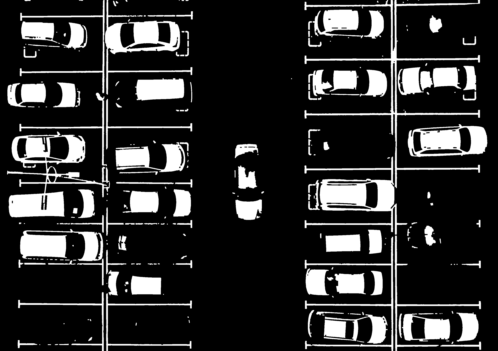

Operasi Closing digunakan untuk menyambungkan bagian objek yang terpisah dan menutup lubang kecil pada objek.

### Analisis Tahap 4

Closing membuat objek terlihat lebih utuh dan memudahkan proses Connected Components. Namun beberapa kendaraan yang memiliki bagian terang dan gelap masih menghasilkan beberapa komponen terpisah.

---

## Tahap 5 – Connected Components dan Counting

### Bounding Box Result


Connected Components digunakan untuk mencari objek yang saling terhubung. Komponen yang memenuhi kriteria luas dan aspect ratio dianggap sebagai kendaraan dan diberikan bounding box.

### Hasil

Jumlah objek terdeteksi:

```text
47
```

### Analisis Tahap 5

Jumlah objek yang terdeteksi jauh lebih besar dibandingkan jumlah kendaraan sebenarnya. Hal ini terjadi karena satu kendaraan sering terpecah menjadi beberapa komponen berbeda. Selain itu marka parkir dan objek terang lainnya juga ikut dihitung sebagai kendaraan sehingga menyebabkan overcounting.

---

## Kesimpulan Percobaan 3

Metode Otsu Thresholding mampu menghasilkan segmentasi objek secara otomatis tanpa menentukan nilai threshold secara manual. Namun pada citra parkir ini metode tersebut menghasilkan banyak komponen yang bukan kendaraan dan sering memecah satu kendaraan menjadi beberapa objek. Akibatnya jumlah deteksi menjadi jauh lebih besar dibandingkan kondisi sebenarnya (overcounting).

---

# Perbandingan Hasil

Tabel berikut menunjukkan jumlah objek yang berhasil dideteksi oleh masing-masing metode.

| Metode            | Jumlah Objek Terdeteksi |
| ----------------- | ----------------------- |
| HSV Segmentation  | 31                      |
| Edge Detection    | 13                      |
| Otsu Thresholding | 47                      |

---

# Analisis Perbandingan

Ketiga metode menghasilkan performa yang berbeda karena masing-masing menggunakan karakteristik citra yang berbeda untuk mendeteksi objek.

### HSV Segmentation

Metode HSV memanfaatkan informasi warna sehingga mampu memisahkan sebagian besar kendaraan berwarna terang dari area aspal. Hasil deteksi yang diperoleh merupakan yang paling mendekati jumlah kendaraan sebenarnya.

Namun metode ini masih memiliki beberapa kelemahan, seperti kendaraan yang hanya terdeteksi sebagian serta kendaraan yang saling berdekatan dan tergabung menjadi satu komponen.

---

### Edge Detection

Metode Edge Detection memanfaatkan informasi tepi objek menggunakan algoritma Canny.

Hasil visualisasi menunjukkan bahwa bentuk kendaraan dapat terlihat dengan cukup jelas. Akan tetapi, banyak kendaraan tidak membentuk region tertutup sehingga contour tidak dapat menganggapnya sebagai objek yang valid untuk dihitung.

Akibatnya jumlah kendaraan yang terdeteksi menjadi jauh lebih sedikit dibandingkan kondisi sebenarnya.

---

### Otsu Thresholding

Metode Otsu Thresholding melakukan segmentasi berdasarkan intensitas piksel.

Metode ini menghasilkan jumlah objek yang paling banyak karena satu kendaraan sering terpecah menjadi beberapa komponen yang berbeda. Selain itu marka parkir dan objek terang lainnya juga ikut terdeteksi sebagai objek.

Akibatnya terjadi overcounting yang cukup signifikan.

---

# Kesimpulan

Pada mini project ini telah dilakukan perbandingan tiga pendekatan pengolahan citra untuk menghitung jumlah kendaraan pada citra area parkir, yaitu HSV Segmentation, Edge Detection, dan Otsu Thresholding.

Berdasarkan hasil eksperimen, HSV Segmentation memberikan performa terbaik dibandingkan dua metode lainnya dengan jumlah deteksi yang paling mendekati kondisi sebenarnya. Metode ini mampu memanfaatkan informasi warna untuk memisahkan kendaraan dari latar belakang, meskipun masih terdapat beberapa kesalahan deteksi.

Edge Detection mampu menampilkan bentuk kendaraan dengan baik namun kurang efektif untuk proses counting karena banyak kendaraan tidak membentuk region tertutup.

Otsu Thresholding menghasilkan jumlah deteksi terbesar, namun mengalami overcounting karena satu kendaraan dapat terpecah menjadi beberapa komponen dan objek non-kendaraan ikut terdeteksi.

Dari hasil yang diperoleh dapat disimpulkan bahwa pemilihan metode segmentasi sangat mempengaruhi akurasi object counting. Untuk penelitian atau pengembangan lebih lanjut, performa deteksi dapat ditingkatkan dengan menggabungkan beberapa metode segmentasi atau menggunakan pendekatan object detection yang lebih canggih.

---

# Struktur Repository

```text
mp2-object-counting/
│
├── counting.py
│
├── README.md
│
├── input/
│   └── parking.jpg
│
└── output/
    ├── result.png
    │
    └── steps/
        ├── 00_original.png
        ├── ...
        └── 20_threshold_bounding_box.png
```

---

# Cara Menjalankan Program

1. Pastikan Python telah terinstal.
2. Install library yang diperlukan.

```bash
pip install opencv-python numpy matplotlib
```

3. Letakkan citra input pada folder:

```text
input/
```

4. Jalankan program:

```bash
python counting.py
```

5. Hasil deteksi akhir akan disimpan pada:

```text
output/result.png
```

6. Seluruh tahapan proses dapat dilihat pada:

```text
output/steps/
```
